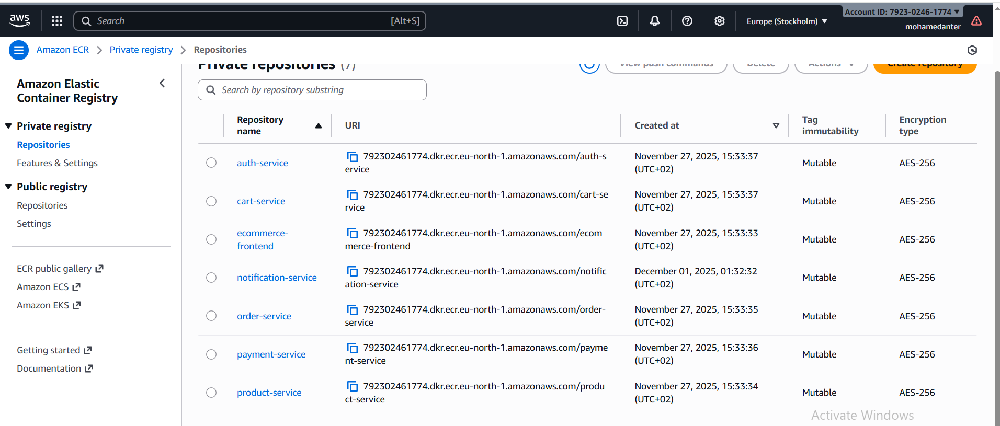

# CI/CD Pipeline for M3 Shop Ecommerce Microservices

---

## Overview

This GitHub Actions workflow automates the continuous integration and continuous deployment (CI/CD) pipeline for the **M3 Shop** ecommerce microservices project.

It builds Docker images for all microservices, pushes them to **Amazon ECR**, and then updates the Kubernetes cluster running on **Amazon EKS** with the latest images by restarting the deployments.

---

## Workflow Triggers

- Runs on **push** or **pull request** events to the `main` branch.
- Ensures that only code merged to `main` gets deployed.

---

## Workflow Jobs and Steps

### 1. Setup Environment and Checkout Code

- Checks out the repository code.
- Sets environment variables such as AWS region, ECR registry URL, and image tags.

### 2. Configure AWS Credentials

- Uses stored GitHub secrets (`AWS_ACCESS_KEY_ID` and `AWS_SECRET_ACCESS_KEY`) to authenticate with AWS.
- Sets AWS region (`eu-north-1`).

### 3. Login to Amazon ECR

- Authenticates Docker CLI to Amazon Elastic Container Registry to allow pushing images.

### 4. Build and Push Docker Images

- Builds Docker images for each microservice:
  - `ecommerce-frontend`
  - `auth-service`
  - `product-service`
  - `cart-service`
  - `order-service`
  - `payment-service`
  - `notification-service`
  
- Pushes the built images to the respective ECR repositories with the tag `latest`.

### 5. Install kubectl CLI

- Downloads and installs the latest stable `kubectl` command line tool for interacting with Kubernetes clusters.

### 6. Update kubeconfig for EKS Cluster

- Uses AWS CLI to update the local kubeconfig file, so `kubectl` can communicate with the `my-eks-cluster` EKS cluster in region `eu-north-1`.

### 7. Verify Kubernetes Access

- Runs `kubectl get nodes` to confirm access and connectivity with the cluster.

### 8. Restart Kubernetes Deployment

- Restarts the `ecommerce-frontend` deployment to pull the latest Docker image and apply updates.

---

## How to Use This Workflow

1. **Setup AWS Credentials:**

   - Store your AWS credentials in your GitHub repository secrets as:
     - `AWS_ACCESS_KEY_ID`
     - `AWS_SECRET_ACCESS_KEY`

2. **Configure ECR and EKS:**

   ### Amazon ECR Repository

---

   - Make sure your ECR repositories exist and are named as in the workflow.
   - Ensure your EKS cluster name matches the one in the workflow (`my-eks-cluster`).
   - Update the AWS region if necessary.

3. **Push Code to Main Branch:**

   - Any push or pull request merged to the `main` branch will trigger this workflow.

4. **Monitor Workflow:**

   - Go to the GitHub **Actions** tab to monitor the workflow progress and logs.

---

## Notes

- The workflow uses the `latest` tag for Docker images, which can be improved by using commit SHAs or version numbers for better traceability.
- Currently, only the `ecommerce-frontend` deployment is restarted after build. You can extend this step to restart other services as needed.
- You may customize the namespace or add rolling update strategies in your Kubernetes manifests for zero downtime deployments.

---

