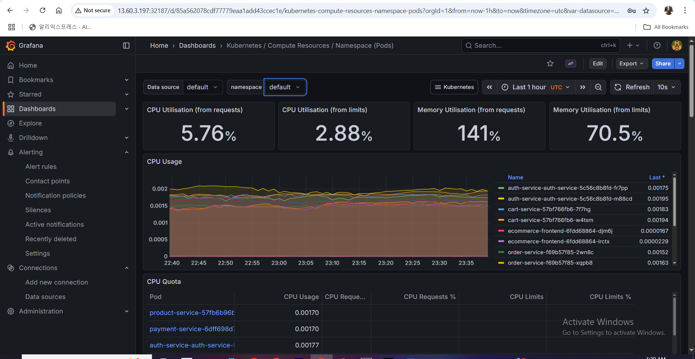
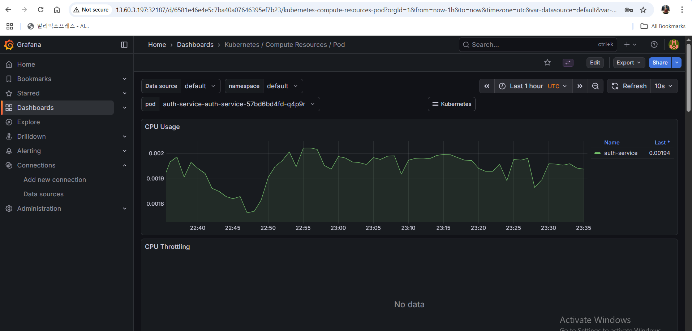
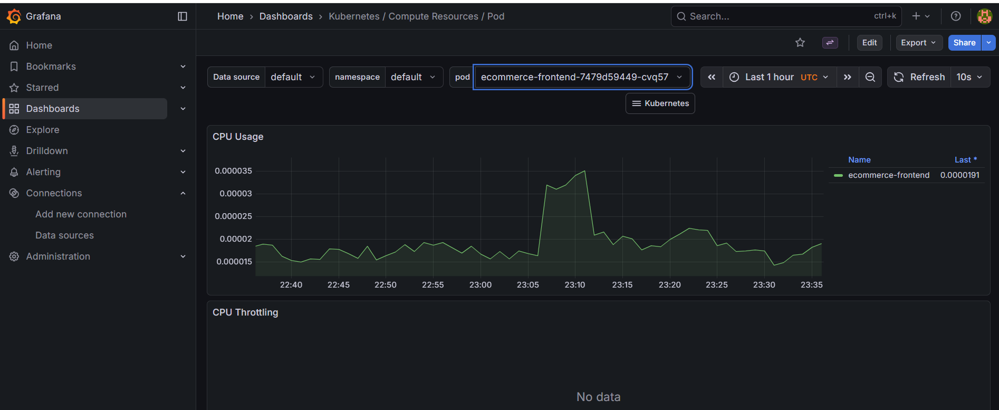

# 🚀 Ecommerce Microservices - End-to-End GitOps CI/CD Pipeline on AWS

A fully automated microservices ecommerce platform leveraging Terraform for infrastructure provisioning, Helm for Kubernetes package management, GitHub Actions for CI/CD, ArgoCD for GitOps deployment, and robust monitoring & logging.
---
## Project Architecture 

---
## 🏗️ Architecture Overview
###1. ☁️ AWS Infrastructure (Provisioned by Terraform)

   - VPC, Subnets, Internet Gateway: Network setup for secure and scalable deployment

   ** Amazon EKS Cluster**:
 
   - Managed Kubernetes control plane by AWS

   - Worker nodes running the microservices containers

   **Supporting AWS Services**:

   - ECR (Elastic Container Registry): Stores Docker images

   - RDS PostgreSQL: Persistent storage for relational data

   - Redis (optional): Caching layer (if used)
---
###2. 📦 Microservices Architecture
-** Each microservice is containerized with Docker**

 - Independently deployable via Helm charts

 - Communicate via REST APIs
 **Services include**:

  - Auth Service (User authentication & authorization)

  - Product Service (Product catalog)

  - Cart Service (User shopping carts)

  - Order Service (Order management)

  - Payment Service (Payment processing)

  - Notification Service (User notifications)

 See each service folder for detailed README.
|  |  |  |
|----------------------------------------------|-----------------------------------------------|--------------------------------------------------|
---
###3. ⚙️ CI/CD Pipeline with GitHub Actions

 - Automated pipeline triggered on main branch changes

 - Steps include:

 - Checkout source code

 - Build Docker images for each microservice & frontend

 - Push images to AWS ECR

 - Update Kubernetes manifests

 - Trigger ArgoCD sync (via Git commit or webhook)
----
###4. ☸️ Kubernetes Deployment using Helm & ArgoCD (GitOps)

 - Helm charts for each microservice under helm/ directory

 - ArgoCD watches Git repository for manifest changes

 - Syncs and deploys updated apps to the EKS cluster automatically
----
###5. 📊 Monitoring & Logging

 - Prometheus & Grafana for cluster and application monitoring

 - Custom alerting rules configured in the monitoring namespace

 - Dashboards visualize microservices health and usage
|  |  |  |
|------------------------------------------------------------------|------------------------------------------------------------|---------------------------------------------------------------|
----
##🗂️ Project Structure Overview
```bash
.
├── .github/workflows/      # GitHub Actions CI/CD pipelines
├── argocd-apps/            # ArgoCD GitOps manifests & configurations
├── helm/                   # Helm charts for all microservices & frontend
├── terraform-eks/          # Terraform modules & infrastructure provisioning scripts
├── ecommerce-frontend/     # React frontend application with Dockerfile
├── auth-service/           # Auth microservice code & Helm chart
├── product-service/        # Product microservice code & Helm chart
├── cart-service/           # Cart microservice code & Helm chart
├── order-service/          # Order microservice code & Helm chart
├── payment-service/        # Payment microservice code & Helm chart
├── notification-service/   # Notification microservice code & Helm chart
├── monitoring/             # Prometheus, Grafana configs and alerts
├── screenshots/            # Architecture & screenshots of project components
└── README.md               # This main project README file
```
----
##⚙️ Technologies & Tools Used
```bash
| Category         | Tools / Services                               |
| ---------------- | ---------------------------------------------- |
| Infrastructure   | AWS (EKS, RDS PostgreSQL, ECR, VPC), Terraform |
| Containerization | Docker                                         |
| CI/CD            | GitHub Actions                                 |
| Kubernetes       | Helm, ArgoCD                                   |
| Monitoring       | Prometheus, Grafana, CloudWatch                |
| Languages        | Python (FastAPI), JavaScript (React)           |
| Database         | PostgreSQL (RDS)                               |
| Caching          | Redis (optional, if used)                      |
```
------
##⚡ How to Get Started

-Clone the repo

-Review infrastructure provisioning in terraform-eks/

-Explore microservices in their respective folders and their Helm charts

-Setup GitHub Actions secrets for AWS credentials and ECR registry

-Push code changes to trigger full pipeline

-Watch deployments live in ArgoCD UI
------
## 👨‍💻 Author

**Mohamed Anter**  
Cloud DevOps Engineer  

## 📬 Contact

- [](

https://www.linkedin.com/in/mohamed-anter-developer/)

- 📧 mohamedanter845@gmail.com
