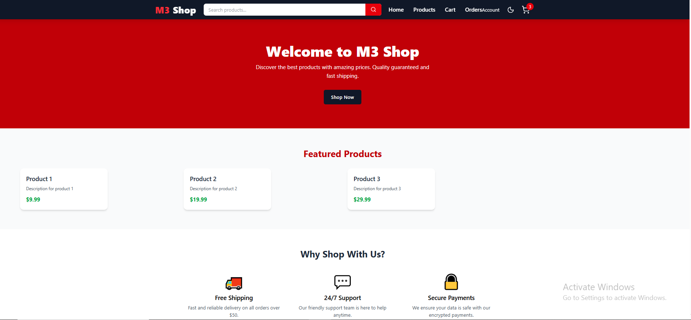
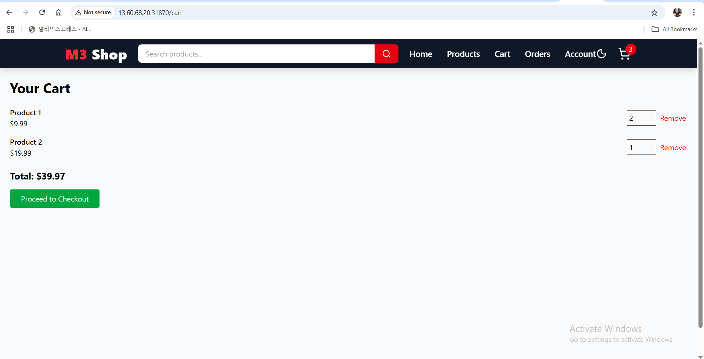
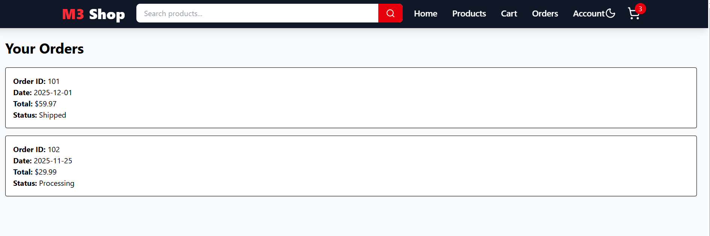

# 🚀 Ecommerce Microservices - End-to-End GitOps CI/CD Pipeline on AWS

A fully automated microservices ecommerce platform leveraging Terraform for infrastructure provisioning, Helm for Kubernetes package management, GitHub Actions for CI/CD, ArgoCD for GitOps deployment, and robust monitoring & logging.
---
## Project Architecture 

---
## 🏗️ Architecture Overview
###1. ☁️ AWS Infrastructure (Provisioned by Terraform)

    - VPC, Subnets, Internet Gateway: Network setup for secure and scalable deployment

    -  Amazon EKS Cluster:
 
    - Managed Kubernetes control plane by AWS

    - Worker nodes running the microservices containers

 Supporting AWS Services:

   - ECR (Elastic Container Registry): Stores Docker images

   - RDS PostgreSQL: Persistent storage for relational data

   - Redis (optional): Caching layer (if used)
---
###2. 📦 Microservices Architecture
 - Each microservice is containerized with Docker

 - Independently deployable via Helm charts

 - Communicate via REST APIs

 Services include:

  - Auth Service (User authentication & authorization)

  - Product Service (Product catalog)

  - Cart Service (User shopping carts)

  - Order Service (Order management)

  - Payment Service (Payment processing)

  - Notification Service (User notifications)

 See each service folder for detailed README.
|  |  |  |
|----------------------------------------------|-----------------------------------------------|--------------------------------------------------|
---
