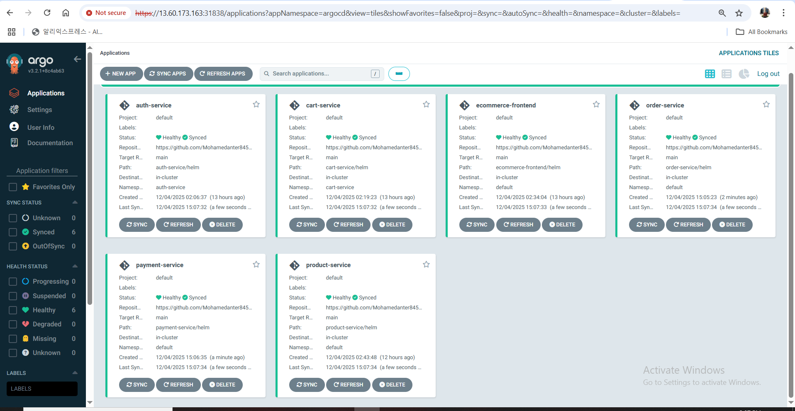
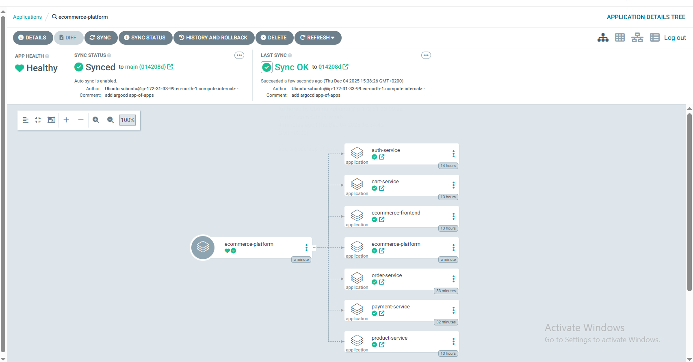

# 📦 ArgoCD Applications for Ecommerce Microservices

This directory contains ArgoCD Application manifests used to deploy and manage the **Ecommerce Microservices** project on a Kubernetes cluster using GitOps.

---

## 🚀 What is `applications.yaml`?

- It defines multiple ArgoCD **Application** resources.
- Each Application corresponds to a microservice in the ecommerce system (auth, cart, product, order, payment, frontend).
- Each service is deployed using its respective **Helm chart** located in the repository.
- ArgoCD continuously syncs the Kubernetes cluster state with the Git repository to ensure desired state deployment (GitOps workflow).

---

## 📸 ArgoCD Screenshots

### ArgoCD Project Overview  


### ArgoCD Folder Structure in UI  


---

## 📋 File Contents Overview

- **Project:** All applications are under the default ArgoCD project (`default`).
- **repoURL:** Points to your GitHub repository at `https://github.com/Mohamedanter845/ecommerce-microservices`.
- **targetRevision:** The branch/tag to deploy from, set to `main`.
- **path:** Points to the Helm chart directory for each microservice inside the repo.
- **destination:** Specifies the target Kubernetes namespace for each application.
- **syncPolicy:**  
  - Automated sync enabled for automatic deployments on Git changes.  
  - `prune: true` ensures resources deleted from Git are removed from the cluster.  
  - `selfHeal: true` means ArgoCD will fix any manual drift from desired state.

---

## 🛠️ Applications Managed

| Application Name   | Kubernetes Namespace | Path in Repo             |
|--------------------|----------------------|-------------------------|
| ecommerce-platform  | argocd               | argocd-apps              |
| auth-service       | auth-service          | auth-service/helm        |
| cart-service       | cart-service          | cart-service/helm        |
| product-service    | product-service       | product-service/helm     |
| order-service      | order-service         | order-service/helm       |
| payment-service    | payment-service       | payment-service/helm     |
| ecommerce-frontend | frontend              | ecommerce-frontend/helm  |

---

## ⚙️ How to Use

1. **Install ArgoCD** on your Kubernetes cluster (if not already installed).  
2. Place this `applications.yaml` manifest in your Git repository under `argocd-apps/`.  
3. Configure ArgoCD to watch this repository and path, or manually apply the manifest:  
   ```bash
   kubectl apply -f applications.yaml -n argocd
````
ArgoCD will automatically create and manage the listed applications, deploying each service to its specified namespace.

Any changes pushed to the repo under the monitored paths will trigger automated sync and deployment.
-----------
📚 Useful Links

-ArgoCD Official Documentation

-GitOps with ArgoCD

-Helm Charts
-----------------------
👨‍💻 Author

Developed and maintained by Mohamed Anter
GitHub: github.com/Mohamedanter845
