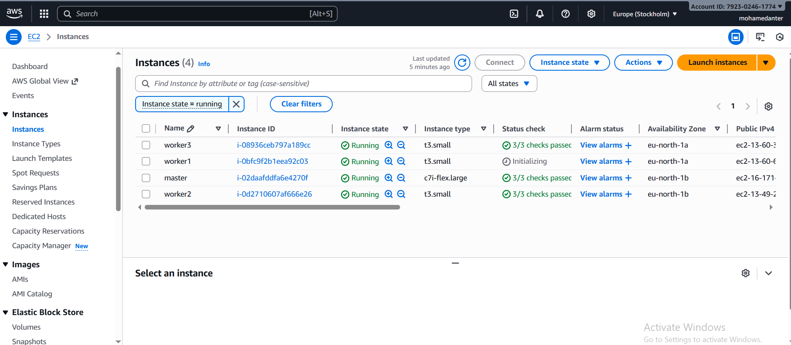
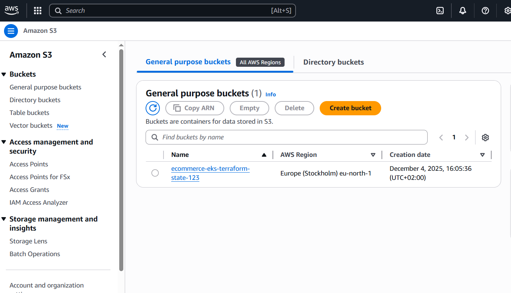
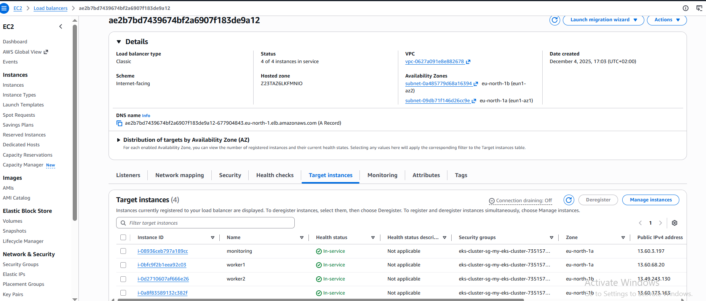

# 🏗️ Terraform AWS EKS Infrastructure

Comprehensive Terraform configuration to provision a highly available, scalable, and secure **Amazon EKS (Elastic Kubernetes Service)** cluster alongside the necessary AWS infrastructure components.

---

## 🔍 Project Overview

This Terraform project automates the deployment of a production-grade Kubernetes cluster on AWS, including:

- **Networking:** VPC with segmented public and private subnets, routing, NAT gateway, and Internet gateway.
- **Security:** Fine-grained IAM roles and policies tailored for EKS control plane and worker nodes.
- **Compute:** Managed EKS cluster and autoscaling managed node groups.
- **Observability & Extensibility:** Outputs critical cluster information for seamless integration with CI/CD pipelines and cluster management tools.

---

## 📂 Repository Structure

| Filename           | Description                                           |
|--------------------|-------------------------------------------------------|
| `main.tf`          | Core AWS infrastructure resources: VPC, Subnets, IGW, NAT, IAM Roles, EKS cluster, Node Groups |
| `provider.tf`      | Provider configurations and required Terraform versions |
| `variables.tf`     | Input variable declarations (see examples below)     |
| `outputs.tf`       | Defined outputs exposing key infrastructure details   |
| `terraform.tfstate`| Terraform state files (auto-generated, do not edit)  |

---

## ⚙️ Infrastructure Components

### 1. **Networking**

- **VPC:** Customizable CIDR with DNS support.
- **Subnets:** Multi-AZ public and private subnets for high availability.
- **Routing:**
  - Internet Gateway attached for public subnet internet access.
  - NAT Gateway configured in public subnet for outbound access from private subnets.
- **Route Tables:** Dedicated for public and private subnets ensuring proper traffic flow.

### 2. **IAM Roles & Policies**

- **EKS Cluster Role:** Permissions to manage the EKS control plane.
- **EKS Node Group Role:** Grants worker nodes access to AWS APIs, container registry, and networking.
- Managed policies include:
  - `AmazonEKSClusterPolicy`
  - `AmazonEKSVPCResourceController`
  - `AmazonEKSWorkerNodePolicy`
  - `AmazonEKS_CNI_Policy`
  - `AmazonEC2ContainerRegistryReadOnly`

### 3. **Amazon EKS Cluster**

- Kubernetes version **1.30** (configurable).
- Multi-AZ support via combined public and private subnet IDs.
- Managed via IAM roles defined above.

### 4. **EKS Managed Node Group**

- Autoscaling enabled with configurable min, max, and desired instance counts.
- Node instances deployed in public subnets.
- Supports a customizable EC2 instance type for optimal workload matching.

---

## 📊 Architecture Diagrams

### EC2 Instances (Worker Nodes)  


### S3 Bucket (Terraform State Backend or other uses)  


### Load Balancer (Service Exposure)  


---

## 🛠️ Usage

### Prerequisites

- Terraform CLI v1.0+ installed.
- AWS CLI configured with sufficient IAM permissions.
- AWS account with available quotas for VPC, EC2, EKS, etc.

### Steps

```bash
# Initialize Terraform and download providers
terraform init

# Review execution plan before applying
terraform plan

# Deploy infrastructure
terraform apply

# To tear down infrastructure when no longer needed
terraform destroy
----------------------

🔧 Inputs (Excerpt from variables.tf)
Variable	Description	Type	Default / Example	Required
cluster_name	EKS cluster name	string	"production-eks-cluster"	yes
aws_region	AWS region to deploy resources	string	"us-east-1"	yes
vpc_cidr	VPC CIDR block	string	"10.0.0.0/16"	yes
public_subnets	List of public subnet CIDRs	list	["10.0.1.0/24", "10.0.2.0/24"]	yes
private_subnets	List of private subnet CIDRs	list	["10.0.3.0/24", "10.0.4.0/24"]	yes
node_instance_type	EC2 instance type for worker nodes	string	"t3.medium"	yes
desired_capacity	Desired number of nodes in the node group	number	2	yes
min_capacity	Minimum number of nodes	number	1	yes
max_capacity	Maximum number of nodes	number	3	yes
node_group_name	Name of the EKS worker node group	string	"production-node-group"	yes


````
------------------
````
📤 Outputs
Output Name	Description
cluster_endpoint	URL endpoint for Kubernetes API server
cluster_certificate_authority	CA certificate data for secure communication
cluster_name	Name of the provisioned EKS cluster
node_group_role_arn	IAM Role ARN attached to EKS worker nodes
vpc_id	The ID of the created VPC
public_subnet_ids	List of public subnet IDs
private_subnet_ids	List of private subnet IDs

````
---------------------
```
📚 References & Further Reading

Terraform AWS Provider Docs

AWS EKS User Guide

AWS IAM Best Practices

Terraform Best Practices

👨‍💻 Maintainer

Mohamed Anter
GitHub: github.com/Mohamedanter845
--------------
